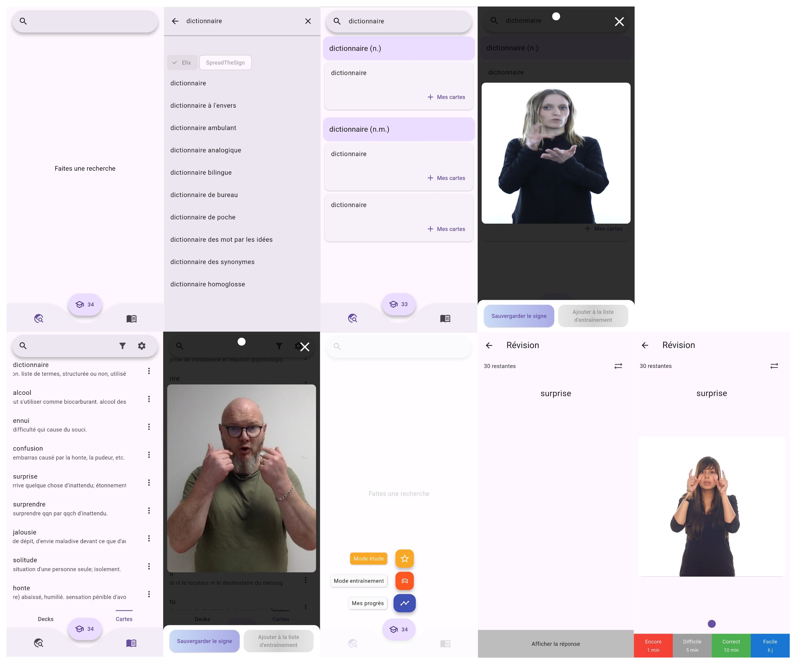

# **📚 Learn LSF with Spaced Repetition**

*LSF Repetition* helps you efficiently memorize French Sign Language (LSF) signs using the [**FSRS**](https://github.com/open-spaced-repetition/fsrs4anki/wiki/Spaced-Repetition-Algorithm:-A-Three%E2%80%90Day-Journey-from-Novice-to-Expert) spaced repetition algorithm. It is powered by data from the [elix-lsf.fr](https://dico.elix-lsf.fr/) dictionary and offers a simple interface to search, save, and review signs daily.

  

## **✨ Main Features**

- 🔍 **Search for signs by word**
- 📁 **Save signs in custom folders**
- 🧠 **Training Mode**
    
    Freely review recently added signs without constraints.
    
- 📈 **Study Mode (smart review)**
    
    Activate optimized review with spaced repetition to retain signs long-term.
    
- **🌎 Language: French and English**
 

## **🧠 Study Mode & Spaced Repetition**

The **Study Mode** is the core of the app. It uses [**spaced repetition**](https://en.wikipedia.org/wiki/Spaced_repetition), a science-based learning technique based on a simple principle:

> The more often you review information just before forgetting it, the longer you retain it.
> 

Instead of reviewing all signs every day, the algorithm determines **which signs need to be reviewed today** to strengthen long-term memory, and **which ones can wait a few days or weeks**.

Studies have shown that spaced repetition:

- Can **double your retention rate** compared to traditional methods (*Rea & Modigliani 1985*);
- **Reduces the number of reviews** needed to learn facts with the same effectiveness (*Donovan & Radosevich 1999*);

This approach helps you:

- **Save time** by reviewing only what's necessary;
- **Retain more**, with less effort;
- **Reinforce your knowledge** for the long run.
 

## **⚙️ How Study Mode Works**

The counter in the center of the navigation bar shows how many signs are ready for review. **If the number is greater than zero, tapping this button will show you a yellow button to launch the Study Mode.**

In this mode, the app shows only the signs that are due for review today. You don't need to configure anything — the algorithm handles it for you.

### **How it works:**

1. Tap the **“Study”** button (yellow) when it is active after a click on the big button in the bottom bar.
2. The app will show you **only the signs you are most likely to forget**, at the optimal time.
3. For each sign, you indicate whether you remembered it easily, moderately, or not at all.
4. Based on your answer, FSRS automatically decides **when you’ll need to review that sign again**.

> The easier a sign feels, the less frequently it will appear. Harder signs will come back more often.
>